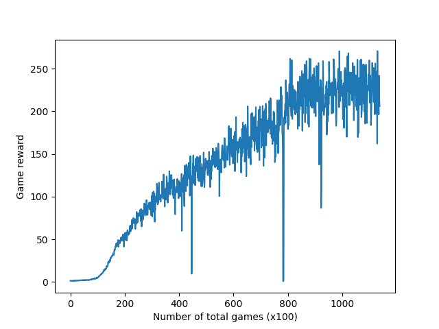

# FLARE
https://idlrl.github.io/flare

## Design

FLARE is a reinforcement learning (RL) framework for training [embodied agents](https://en.wikipedia.org/wiki/Embodied_agent) with [PyTorch](https://pytorch.org/). The design philosophy of FLARE is to maximize its flexibility so that a *researcher* can easily apply it to a variety of scenarios or tasks. By "easily", we mean at least four properties:

1. ***The code is modular.*** For a new problem the researcher might only need to change some (hopefully a small number of) modules of the existing code while keeping the rest unchanged. For example, when the user decides to switch from "Q-learning" to "SARSA", he/she probably only has to change the learning objective but not the network configuration (since both algorithms require outputting Q-values).

2. ***The code is extensible.*** Usually an embodied agent would have multiple tasks learned in parallel (e.g., language ability and vision ability). And sometimes some other unsupervised learning tasks might be added to facilitate feature learning. So FLARE should be able to easily combine several tasks that require distinct objective functions, or to easily add a new task to existing ones whenever the researcher feels necessary.

3. ***The support for complex computations due to the broad range of various algorithms that are involved in modeling an embodied agent.*** It should be convenient in FLARE to have computational branches of neural nets and conditional code behaviors. For this reason, we choose PyTorch because of its dynamic computational graph and that it blends well in the host language.

4. ***Extensible data I/O between an agent and different environments.*** In FLARE, the researcher only needs to spend a tiny effort on the change of agent-environment communication when the agent is placed in a new environment that has new sensor inputs or requires new actions.

## Prerequisites
FLARE is currently a pure Python framework which doesn't need build. Several dependent tools:
* [PyTorch](https://pytorch.org/)
* [Glog](https://pypi.org/project/glog/)
* [OpenAI Gym](https://gym.openai.com/) (for running examples)

That's it. Enjoy training agents with FLARE!

## Add FLARE to python paths
To add the repository to your python paths permanently, append the following line to ```~/.bashrc```:
```bash
export PYTHONPATH=<flare_root>:$PYTHONPATH
```

## A quick tutorial in 5 minutes
Some quick examples can be found in `flare/examples`. Below we show step-by-step code to train the "CartPole-v0" game from OpenAI Gym.

a) First we import different Python modules which all together constitute the overall training pipeline. Some modules such as ```SimpleAC```, ```SimpleModelAC```, and ```SimpleRLAgent``` were already implemented by us as *examples* of Algorithm, Model, and Agent classes. The users are encouraged to modify or write their own for more complex problems. This advanced topic of user customizing modules is explained in details in [Modules](tutorial/modules.md).

```python
"""
flare/examples/ac_example.py
"""

## import PyTorch nn module
import torch.nn as nn
## use a simple Actor-critic algorithm
from flare.algorithm_zoo.simple_algorithms import SimpleAC
## import the Manager to manage agents running in parallel
from flare.framework.manager import Manager
## use a simple network to compute the policy and value
from flare.model_zoo.simple_models import SimpleModelAC
## RL agent with simple control logic
from flare.agent_zoo.simple_rl_agents import SimpleRLAgent
## the agent collects data in an on-line manner without a replay buffer
from flare.framework.agent import OnPolicyHelper
## import a wrapped version of OpenAI Gym
from flare.framework.env import GymEnv
```

b) Then we configure the problem and initialize the environments.

```python
game = "CartPole-v0"

num_agents = 16    ## 16 agents running in parallel
num_games = 8000   ## each agent runs for 8000 games

envs = []
for _ in range(num_agents):
    envs.append(GymEnv(game))  ## init an environment for each agent

## get the environment observation dimension and the number of actions
state_shape = envs[-1].observation_dims()[0]
num_actions = envs[-1].action_dims()[0]
```

c) Next we construct the neural network and choose the algorithm to train the network.

```python
## For this simple problem, our model uses an MLP to directly map
## each input vector to a latent embedding of 128 dimensions.
mlp = nn.Sequential(
    nn.Linear(state_shape[0], 128),
    nn.ReLU(),
    nn.Linear(128, 128), nn.ReLU(), nn.Linear(128, 128), nn.ReLU())

## The learning algorithm is specified through defining an Algorithm object,
## which takes a Model object as its argument. In this example, we uses an
## algorithm called SimpleAC; it implements simple Actor-critic by taking
## the latent embedding output by the model defined above to generate a discrete
## policy and a value.
alg = SimpleAC(model=SimpleModelAC(
    dims=state_shape, num_actions=num_actions, perception_net=mlp))
```

d) In this example, each agent has a single computation task (i.e., 'RL'). Below we set the hyperparameters and options for this computation task, and create a Manager from the settings.

```python
ct_settings = {
    "RL": dict(
        algorithm=alg,       ## pass in the algorithm object
        hyperparas=dict(lr=5e-5),   ## set the learning rate
        # sampling
        agent_helper=OnPolicyHelper,   ## the training data collection is on-policy
        # each agent will call `learn()` every `sample_interval` steps
        sample_interval=4,
        num_agents=num_agents)
}
### create a manager that handles the running of the whole pipeline
manager = Manager(ct_settings)
```

e) Add all the 16 agents to the manager and start training!

```python
# Spawn one agent for each instance of environment.
for env in envs:
    agent = SimpleRLAgent(env, num_games)
    # An agent has to be added into the manager before we can use it to
    # interact with environment and collect data
    manager.add_agent(agent)

manager.start()
```

Suppose that the root directory of FLARE is `<flare_root>`. To run the above code, you can simply do
```bash
cd <flare_root>; python flare/examples/ac_example.py
```

The game reward is expected to reach and maintain the maximal value of 199.0 (i.e., the cart holds the pole until timeout) after about 4k games trained on a machine with 16 CPUs.

## Easy adaptation to new problems
Suppose now we still want to use Actor-critic to train an agent, but this time to play [Breakout](https://en.wikipedia.org/wiki/Breakout_(video_game)) from raw pixel inputs. Because of the flexibility of FLARE, we are able to easily adapt the above code to solve the new problem by only having to redefine the perception net of the model:
```python
# 1. Create image environments
im_height, im_width = 84, 84 # always resize image to 84x84
envs = []
for _ in range(num_agents):
    envs.append(GymEnvImage(game, contexts=4,
                            height=im_height, width=im_width, gray=True))

# context screens
d, h, w = envs[-1].observation_dims()[0]
num_actions = envs[-1].action_dims()[0]

# 2. Construct the network and specify the algorithm.
#    Here we use a small CNN as the perception net for the Actor-Critic algorithm
cnn = nn.Sequential(
    nn.Conv2d(d, 32, kernel_size=8, stride=4),
    nn.ReLU(),
    nn.Conv2d(32, 64, kernel_size=4, stride=2),
    nn.ReLU(),
    nn.Conv2d(64, 64, kernel_size=3, stride=1),
    nn.ReLU(),
    Flatten(),  # flatten the CNN cube to a vector
    nn.Linear(7 * 7 * 64, 256),
    nn.ReLU()
)

alg = SimpleAC(model=SimpleModelAC(
    dims=(d, h, w), num_actions=num_actions, perception_net=cnn),
               gpu_id=1)
```
Except for some hyperparameters (e.g., number of agents, learning rate, gradient clipping, etc), the rest of the code logic is unchanged. To run this example:
```bash
cd <flare_root>; python flare/example/img_ac_example.py
```
Without much hyperparameter tweaking, after a total number of 100k games, the game reward is expected to reach 250, trained with 16 agents with a rollout length of 5. The following is the training curve of *reward vs. number of games*.



## Advanced usage
For advanced usage of FLARE, you might want to take a look at a more comprehensive [tutorial](tutorial/index.md).

## License
FLARE has the Apache 2.0 license.
