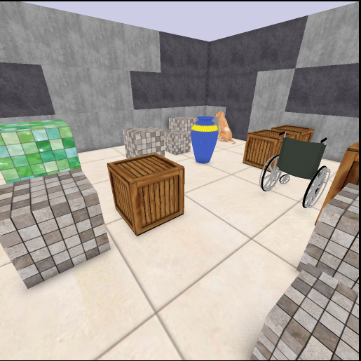
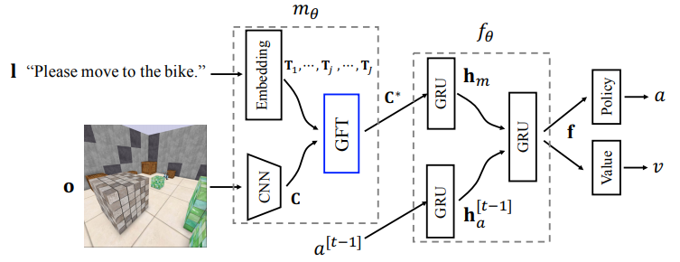
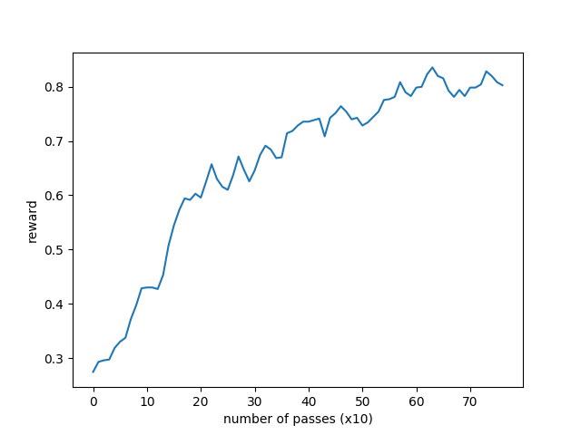

# Tutorial: Learning to Perform Language-directed Tasks in a 3D Environment

In this tutorial, as an advanced use case of FLARE, we will show how to train an embodied agent to perform language-directed tasks in a 3D environment called [XWorld3D](https://github.com/PaddlePaddle/XWorld). We will reimplement the GFT module in the paper

> Guided Feature Transformation (GFT): A Neural Language Grounding Module for Embodied Agents, Yu et al., CoRL 2018

and test it on a subset of the tasks proposed in the paper.

##  Problem description
In the beginning of a session, an agent is put at a random position of 3D environment. It only has partial observation of the environment with a first-person point of view. A teacher will then issue a language command telling the agent where to go by randomly picking an object in the environment as the target. The goal of the agent is to accomplish the navigation task within a fixed number of steps for each session. After the current session ends, a new session is generated with a random environment configuration and a new command.

<p></p>

#### Inputs
The agent receives three inputs:
* RGB images: the environment configuration is partially perceived by the agent as raw pixels.
* Plain sentences: the navigation commands are unstructured sentences.
* Scalar rewards: if the agent reaches the correct object, it gets +1; if the agent hits any incorrect object, it gets -1 and the session ends. The agent also has a time penalty of -0.01 at every step.

#### Outputs
At each step, the agent outputs a discrete action that has six possible values: `move_left`, `move_right`, `turn_left`, `turn_right`, `move_forward`, and `move_backward`.

More details of the problem description can be found in the experiment section (Table 1 `nav`).

## Agent architecture
In order for the agent to correctly navigate, it has to learn to ground language in vision. The CoRL2018 paper proposes a simple language grounding module called GFT where latent sentence embeddings computed from a language input are treated as transformation matrices of visual features output by a CNN. The general idea is that these transformation matrices are used to modulate the visual features so that the final visual perception result is language-dependent. For details, we refer the readers to Section 2 of the paper. Below is the high-level overview of the agent architecture that we will implement.

<p></p>

## Step-by-step implementation
All the code in this section, without explicitly mentioned, is contained in a single file [`xworld3d_navigation.py`](https://github.com/idlrl/flare/blob/master/tutorial/examples/xworld3d_navigation.py). Before start, you need to install [XWorld3D](https://github.com/PaddlePaddle/XWorld) and add it in your Python paths.

#### Environment setup
We first outline the main function. We will run 26 agents in parallel, each agent running for an enough long time until we stop it. The environment is configured with image sizes of 84x84 and a curriculum threshold of 0.7. Once an agent achieves a success rate greather than the threshold, it enters the next level with more complex maps (curriculum schedule in Appendix D). The map and task configurations are provided by a JSON file `walls3d.json`. To create XWorld3D environments, we need to provide a dictionary `dict.txt`. Finally, we obtain some dimension numbers for creating the agents.

One detail to pay attention to is that we set `opengl_init=False` when we create the environment. The reason is that at this moment, we only want to obtain information from the environment without having to truly initialize the OpenGL context. It is important to avoid the initialization here because later when we spawn more environments in subprocesses, it is required that their parent process has not created any OpenGL context yet.

```python
from flare.env_zoo.xworld import XWorldEnv

num_agents = 26
num_games = 1000000

# 1. Create environment arguments
im_size = 84
options = {
    "x3_conf": "../../flare/env_zoo/tests/walls3d.json",
    "x3_training_img_width": im_size,
    "x3_training_img_height": im_size,
    "curriculum": 0.7,
    "color": True
}

with open("../../flare/env_zoo/tests/dict.txt") as f:
    word_list = [word.strip() for word in f.readlines()]

env_class = XWorldEnv
env_args = dict(game_name="xworld3d", options=options,
                word_list=word_list, opengl_init=False)

env = env_class(**env_args)
d, h, w = env.observation_dims()["screen"]
voc_size, = env.observation_dims()["sentence"]
num_actions = env.action_dims()["action"]
```

#### Create agents
Next we create 26 agents and setting an environment for each of them. When creating an agent, we will use the `SimpleRNNRLAgent` class that support short-term memory. Unlike the above, we set `opengl_init=True` for a true environment initialization.

```python
from flare.agent_zoo.simple_rl_agents import SimpleRNNRLAgent

agents = []
env_args["opengl_init"] = True
for _ in range(num_agents):
    agent = SimpleRNNRLAgent(num_games, learning=True, actrep=4)
    agent.set_env(env_class, **env_args)
    agents.append(agent)
```

#### Define the model
To process images, we use a three-layer CNN that outputs a stack of 7x7 feature maps. The convolution results are ReLU activated.

```python
cnn = nn.Sequential(
    ## d is the number of channels of visual screens
    nn.Conv2d(
        d, 32, kernel_size=8, stride=4),
    nn.ReLU(),
    nn.Conv2d(
        32, 64, kernel_size=4, stride=2),
    nn.ReLU(),
    nn.Conv2d(
        64, 64, kernel_size=3, stride=1),
    nn.ReLU())
```
To process sentences, we use a simple Bag-of-words (BoW) layer that sums together word embeddings.
```python
from flare.framework.common_functions import BoW

word_embedding_dim = 128
bow = BoW(dict_size=voc_size, dim=word_embedding_dim, std=0.1)
```
We further define a hidden network that projects a feature cube down to a compact embedding vector.
```python
from flare.framework.common_functions import Flatten

hidden_size = 2 * word_embedding_dim
hidden_net = nn.Sequential(Flatten(),
                           nn.Linear(7 * 7 * 64, hidden_size), nn.ReLU())
```
After these subnetworks are defined, they are passed into the `GFTModelAC` model.
```python
GFTModelAC(img_dims=(d, h, w),
           num_actions=num_actions,
           vision_perception_net=cnn,
           language_perception_net=bow,
           hidden_net=hidden_net)
```
As the first step, `GFTModelAC` has to override `get_state_specs` to define the states. According to the overview figure of the agent architecture, we have three RNNs that require short-term memory. Thus we specify three states
```python
def get_state_specs(self):
    return [("h_m", dict(shape=[self.hidden_size])),
            ("h_a", dict(shape=[self.hidden_size / 2])),
            ("f", dict(shape=[self.hidden_size]))]
```
Note that the state sizes have to match the corresponding RNN sizes. The user could name the states in any way, as long as he uses matching names to retrieve states later. Recall that these state specs will be obtained by `SimpleRNNRLAgent` to initialize the corresponding states before the start of each session as follows:
```python
def _get_init_states(self):
    return {name : self._make_zero_states(prop) \
            for name, prop in self.cts_state_specs['RL']}
```
Next we define the input and action specs:
```python
def get_input_specs(self):
    return [("screen", dict(shape=self.img_dims)),
            ("sentence", dict(shape=[1], dtype="int64")),
            ("prev_action", dict(shape=[1], dtype="int64"))]

def get_action_specs(self):
    return [("action", dict(shape=[1], dtype="int64"))]
```
Among which `prev_action` is needed to remind the agent of what actions were taken before. The keys of the input specs are decided by the environment observation return, and the key of the action specs is decided by the inputs to the environment's `step` function.

Inside the `__init__` function of `GFTModelAC`, we define different components of the architecture.
```python
def __init__(self,
             img_dims,
             num_actions,
             vision_perception_net,
             language_perception_net,
             hidden_net,
             K=2):
    super(GFTModelAC, self).__init__()
    assert isinstance(img_dims, list) or isinstance(img_dims, tuple)
    self.img_dims = img_dims
    self.hidden_size = list(hidden_net.modules())[-2].out_features
    self.gft = GFT(K, vision_perception_net, language_perception_net,
                   hidden_net)
    ## Two-layer RNN
    self.action_embedding = nn.Embedding(num_actions, self.hidden_size / 2)
    self.h_m_cell = GRUCellReLU(self.hidden_size, self.hidden_size)
    self.h_a_cell = GRUCellReLU(self.hidden_size / 2, self.hidden_size / 2)
    self.f_cell = GRUCellReLU(self.hidden_size, self.hidden_size)
    self.fc = nn.Sequential(
        nn.Linear(int(1.5 * self.hidden_size), self.hidden_size),
        nn.ReLU())
    self.policy_layer = nn.Sequential(
        nn.Linear(self.hidden_size, self.hidden_size),
        nn.ReLU(),
        nn.Linear(self.hidden_size, num_actions),
        nn.Softmax(dim=1))
    self.value_layer = nn.Sequential(
        nn.Linear(self.hidden_size, self.hidden_size),
        nn.ReLU(), nn.Linear(self.hidden_size, 1))
```

Even though we have sequential input data, because of `recurrent_group` as shown later in `SimpleAC`, all the model computations are performed in single time steps. As a result, we need to use RNN cells instead of entire RNNs. We implement a GRU cell with ReLU as used in the original paper (see [`common_functions.py`](https://github.com/idlrl/flare/blob/master/flare/framework/common_functions.py).
```python
class GRUCellReLU(nn.Module):
    """
    A self-implemented GRUCell with ReLU activation support
    """

    def __init__(self, input_size, hidden_size):
        super(GRUCellReLU, self).__init__()
        self.r_fc = nn.Linear(input_size + hidden_size, hidden_size)
        self.z_fc = nn.Linear(input_size + hidden_size, hidden_size)
        self.in_fc = nn.Linear(input_size, hidden_size)
        self.hn_fc = nn.Linear(hidden_size, hidden_size)
        self.hidden_size = hidden_size

    def forward(self, input, hx=None):
        # if hx is None:
        #     hx = input.new_zeros(input.size(0), self.hidden_size, requires_grad=False)
        r = torch.sigmoid(self.r_fc(torch.cat((input, hx), dim=-1)))
        z = torch.sigmoid(self.z_fc(torch.cat((input, hx), dim=-1)))
        n = torch.relu(self.in_fc(input) + r * self.hn_fc(hx))
        return (1 - z) * n + z * hx
```

Let us skip the definition of `GFT` for a moment. Suppose that `self.gft` fuses language and vision and outputs a compact grounded result. Given the three RNN cells, we are able to compute the final feature representation `f_` for computing the policy and value:
```python
from torch.distributions import Categorical

def _two_layer_recurrent(self, inputs, states):
    fusion = self.gft(inputs["screen"], inputs["sentence"])
    prev_action = inputs["prev_action"]
    h_m, h_a, f = states["h_m"], states["h_a"], states["f"]
    h_m_ = self.h_m_cell(fusion, h_m)
    h_a_ = self.h_a_cell(
        self.action_embedding(prev_action.squeeze(-1)), h_a)
    f_ = self.f_cell(self.fc(torch.cat((h_m_, h_a_), dim=1)), f)
    return h_m_, h_a_, f_

def policy(self, inputs, states):
    h_m, h_a, f = self._two_layer_recurrent(inputs, states)
    dist = Categorical(probs=self.policy_layer(f))
    return dict(action=dist), dict(h_m=h_m, h_a=h_a, f=f)

def value(self, inputs, states):
    h_m, h_a, f = self._two_layer_recurrent(inputs, states)
    v_value = self.value_layer(f)
    return dict(v_value=v_value), dict(h_m=h_m, h_a=h_a, f=f)
```
Note that in both `policy` and `value`, we have to return the three updated states for both prediction and learning. Finally, the `GFT` class follows exactly the formulation in Section 2 of the paper.
```python
import torch.nn.functional as F

class GFT(nn.Module):
    """
    This class implements the GFT model proposed in the CoRL2018 paper:
    https://arxiv.org/pdf/1805.08329.pdf
    """

    def __init__(self, K, vision_perception_net, language_perception_net,
                 hidden_net):
        super(GFT, self).__init__()
        self.vision_perception_net = vision_perception_net
        self.language_perception_net = language_perception_net
        self.hidden_net = hidden_net
        self.channels = list(vision_perception_net.modules())[-2].out_channels
        ## We should use ModuleList, otherwise the parameters are not registered to GFT
        self.t_layers = nn.ModuleList([
            nn.Linear(language_perception_net.dim,
                      (1 + self.channels) * self.channels) for k in range(K)
        ])

    def forward(self, screen, sentence):
        sentence_embedding = self.language_perception_net(sentence)
        cnn_out = self.vision_perception_net(screen)
        cnn_out = cnn_out.view(cnn_out.size()[0], self.channels, -1)
        ## compute K transformation matrices
        ts = [l(sentence_embedding).view(-1, self.channels, (self.channels + 1)) \
              for l in self.t_layers]

        ones = torch.ones(cnn_out.size()[0], 1, cnn_out.size()[-1])
        if cnn_out.is_cuda:
            ones = ones.to(cnn_out.get_device())

        for t in ts:
            assert t.size()[0] == cnn_out.size()[0]
            cnn_out = torch.cat((cnn_out, ones), dim=1)
            cnn_out = F.relu(torch.matmul(t, cnn_out))
        return self.hidden_net(cnn_out)
```

#### Define the algorithm
We are able to use the existing `SimpleAC` implementation for training the model.
```python
import torch.optim as optim
from flare.algorithm_zoo.simple_algorithms import SimpleAC

alg = SimpleAC(
    model=GFTModelAC(
        img_dims=(d, h, w),
        num_actions=num_actions,
        vision_perception_net=cnn,
        language_perception_net=bow,
        hidden_net=hidden_net),
    gpu_id=1,
    value_cost_weight=1.0,
    prob_entropy_weight=0.05,
    grad_clip=5.0,
    optim=(optim.RMSprop, dict(
        lr=5e-6, momentum=0.9)),
    ntd=True)
```
If you look into `SimpleAC`, you will find that when `states` is not `None`, `learn()` will use `AgentRecurrentHelper` (which further uses `recurrent_group`) to strip one sequence level before calling model functions.
```python
costs = self.recurrent_helper.recurrent(
    ## step function operates one-level lower
    recurrent_step=self._rl_learn,
    input_dict_list=[inputs, actions, next_values, rewards],
    state_dict_list=[states])
```
This is the reason why we can treat the input data as temporally independent inside `GFTModelAC`.

#### Define the manager
Because we are using ParallelA2C [Clemente et al. 2017] for training, we need to set `OnlineHelper` for the agents. This `AgentHelper` will ensure that training data were generated by the most recent parameters. We also require that each agent takes only 4 steps between every two parameter updates. As the last step, we add all the agents to a manager and start training.

```python
from flare.framework.manager import Manager
from flare.framework.agent import OnlineHelper

ct_settings = {
    "RL": dict(
        algorithm=alg,
        show_para_every_backwards=500,
        # sampling
        agent_helper=OnlineHelper,
        # each agent will call `learn()` every `sample_interval` steps
        sample_interval=4,
        num_agents=num_agents)
}

log_settings = dict(
    model_dir="/tmp/test",
    print_interval=100,
    model_save_interval=20,
    load_model=False,
    pass_num=0,
    log_file="/tmp/log.txt")

manager = Manager(ct_settings, log_settings)
manager.add_agents(agents)
manager.start()
```

## Training results
You can go ahead and directly run `<flare_root>/tutorial/examples/xworld3d_navigation.py` which contains the steps that have been went through in the above. The evaluated success rates of the first 200 passes (each pass contains 2k games from 26 agents in total) on the most difficult level (8x8 maps) are shown below. The curve is smoothed by a 7x7 uniform kernel for better visualization.

<p></p>


## Reference
If you use our code, please cite

> Haonan Yu, Xiaochen Lian, Haichao Zhang, Wei Xu, [*Guided Feature Transformation (GFT): A Neural Language Grounding Module
  for Embodied Agents*](https://arxiv.org/abs/1805.08329), CoRL 2018.
