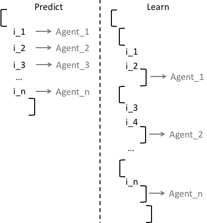

# Short-term Memory for Embodied Agents
So far we have talked about how to train memoryless agents in FLARE, namely, agents that make decisions only based on current observations. This is fine for some simple problems when the observations capture the full state/history of the environment (e.g., in the case of Go where the current board configuration summarizes the entire history of a game), or the decision itself is independent of past decisions (e.g., a 3D agent needs to fire whenever an enemy stands at the center of its view otherwise it will die). However, in practice, most interesting problems (e.g., 3D navigation and multi-round question answering) would require some kind of memory from the agent.

FLARE supports short-term memory. In our scenario of training embodied agents, short-term memory informally refers to quantities that are persistent (but modifiable) throughout an entire episode, from the beginning to the end. Memory that lasts for the entire life of the agent is informally called long-term memory and is not yet supported in FLARE.

## Sequential perception inputs <a name="inputs"/>
The perceived data of an embodied agent in one episode are naturally sequential in time. For example, observed image frames all together consistute a video where consecutive frames have a temporal dependency. Moreoever, within each time step, the agent might receive other sequential data such as sentences. Thus in its most general form, a perception input is a multi-level hierarchy of sequences. An example is illustrated below:

<p></p>

In FLARE, we simply use nested lists for handling hierarchical sequential data. The sequence start and end information is readily encoded in list sizes. The outermost list level (level 0) always denotes a batch. So if a single perception input originally has n levels, then several perception inputs (must *all* have n levels) can form a batch with n+1 levels. Below is a batch (size 2) of sequential inputs, taken from `<flare_root>/flare/framework/tests/test_recurrent.py`:
```python
sentences = [## paragraph 1
             [[[0.3], [0.4], [0.5]],          ## sentence 1
              [[0.1], [0.2]]],                ## sentence 2
             ## paragraph 2
             [[[0.3], [0.4], [0.5]],          ## sentence 3
              [[0.2], [0.2]],                 ## sentence 4
              [[1.0], [0.2], [0.4], [0.5]]],  ## sentence 5
]
```
In the above four-level example,
* at level 3, we have 14 word embeddings of size 1;
* at level 2, we have 5 sentences of lengths (3, 2, 3, 2, 4);
* at level 1, we have 2 paragraphs of lengths (2, 3);
* at level 0, we have 1 batch of 2 paragraphs.

***NOTE: Sequences at level 0 are always temporally independent to each other.***

## States as short-term memory <a name="states"/>
In FLARE, a state is defined to be a vector that boots the processing of a sequence. A state--representing short-term memory--could be any vector that is persistent throughout a sequence, and is not restricted to an RNN state. For example, a state might just be a binary value computed at time 1 and passed down all the way to the sequence end.

Once defined, we require that the number of distinct states at a given level cannot be altered across time steps. For example, suppose that an agent has two RNN states at time 1 at level 1, then there should always be exactly two RNN states passed from each time step to the next time step at level 1.

According to this definition, an agent with short-term memory always maintains a *vertical stack* of states, as illustrated by an example below:

|Level #|States|Explanation|
|:---|:----|:----|
|1|(sentence_state_1, sentence_state_2)|*The first level has two states for processing paragraphs.*|
|2|(word_state_1, word_state_2, word_state_3)|*The second level has three states for processing sentences.*|
|3|(letter_state_1)|*The third level has a single state for processing words.*|

Not all levels require states from the agent. For lower-level sequences that are not segmentable given the agent's time resolution, their states always start with some predefined initial values and do not pass along. In an example where an agent always receives a complete command at every time step, it may not need to maintain a word state for connecting adjacent commands at the word level (even though it indeeds needs a sentence state to connect them at the sentence level).

In the example of the previous [section](#inputs), either agent is defined to have a stack of sentence and word states:
```python
sentence_states = [
    [-2, -4, -6, -8],  ## state vector for paragraph 1
    [-1, -2, -3, -4],  ## state vector for paragraph 2
]

word_states = [
    [1, 1],    ## state vector for sentence 1
    [-1, -1],  ## state vector for sentence 3
]
```
where the first agent has a state stack of `{([-2, -4, -6, -8]), ([1, 1])}` and the second agent has a state stack of `{([-1, -2, -3, -4]), ([-1, -1])}`.

## Recurrent group
Although we have defined the formats of sequential inputs and states, and have talked about conceptually how to perform forward on them, to actually implement a hierarchical computation every time from scratch is still unintuitive. Inspired by the design of [PaddlePaddle](http://www.paddlepaddle.org/), we have provided a powerful helper function called `recurrent_group` to facilitate sequence prediction and learning in FLARE.

The motivation of `recurrent_group` is to strip a hierarchy of sequences step by step, each step removing one level. This helper function applies a *step function* to the stripped inputs. Potentially, the user can further call `recurrent_group` inside the step function again and again, in a recursive manner. The recursion ends when it's no longer necessary or the lowest level is reached.

```python
def recurrent_group(seq_inputs,
                    insts,
                    init_states,
                    step_func,
                    out_states=False):
    """
    Strip a sequence level and apply the stripped inputs to `step_func`
    provided by the user.

    seq_inputs: collection of sequences, each being either a tensor or a list
    insts: collection of static instances, each being a tensor
    init_states: collection of initial states, each being a tensor
    step_func: the function applied to the stripped inputs
    out_states: if True, also output the hidden states produced in the process
    """
```

#### Illustration of level stripping
An illustration of level stripping applied to the example data in an [early section](#inputs), where only two calls of `recurrent_group` are performed:

<p></p>

#### How to define a step function
To be quailfied as a step function at the current sequence level, a function must:
1. Define an argument list that is consistent to the actual provided arguments to `recurrent_group` (`seq_inputs` + `insts` + `init_states`), and
2. Output a pair-tuple where the first element is a list of outputs of an arbitrary length, and the second element is a list of updated states, each being an update to an input state.

#### Batch processing
Because sequences at level 0 are always independent, when processing a batch, `recurrent_group` automatically packs data of multiple sequences to enable parallel computation, after which the results are unpacked to restore the input order. The outputs of `recurrent_group` will preserve the sequential information at the current level.

In details, the batch processing works as follows.
1. Reorder the sequences at the current level according to their lengths, in an descending order. This reordering won't change the computationtational results except for their relative order, assuming that the sequences are independent. Let the length of the first sequence be *max_len*.
2. Set *i = 1*.
3. Take the *i-th* instance from each sequence at the current level to form a batch (packing) and perform a batch computation by applying the step function. Update the states.
4. Set *i = i+1*. If *i < max_len*, go back to 3.
5. Unpack the output sequence by taking the *j-th* element of every instance to form an output for the *j-th* sequence input at the current level.
6. Restore the original order of the sequence inputs.

Note that in step 3, shorter sequences might lack the *i-th* instance. As a result, we need to maintain a dynamic batch size. Each batch formed by step 3 again contains independent sequences, and thus batch processing can be applied to it recursively.

An example is illustrated below.
<p></p>

#### Static inputs
There is a special type of inputs to `recurrent_group`, i.e., static inputs `insts`. Each static input has only two levels and is a batch of static instances. The static instances are supposed to match the sequence inputs at the current level:
* The number of static instances should be equal to the number of sequences.
* Each static input pairs with a sequence and remains *constant* throughout the processing of that sequence.

For example, in image question answering, the input image remains constant during the processing of the paired sentence.

It should be noted that a sequential input A could be converted to a static input to pair with a sequential input B after being stripped one or more levels, for example:
```python
## 'imgs' is A and 'sentences' is B
sentences = [## paragraph 1
             [[[0.3], [0.4], [0.5]],          ## sentence 1
              [[0.1], [0.2]]],                ## sentence 2
             ## paragraph 2
             [[[0.3], [0.4], [0.5]],          ## sentence 3
              [[0.2], [0.2]],                 ## sentence 4
              [[1.0], [0.2], [0.4], [0.5]]],  ## sentence 5
]
imgs = [
    [[2.0, 2.0, 2.0],  ## image 1
     [3.0, 3.0, 3.0]], ## image 2
    [[1.0, 1.0, 1.0],  ## image 3
     [4.0, 4.0, 4.0],  ## image 4
     [5.0, 5.0, 5.0]]  ## image 5
]
```
After first calling `recurrent_group` on both `sentences` and `imgs` as `seq_inputs`, inside the step function, the user could use `imgs` as five static images (`insts`) for the five sentences and call `recurrent_group` on them again.

#### Code example
A concrete code example of using `recurrent_group` to process sequential data can be found in `<flare_root>/flare/framework/tests/test_recurrent.py`:
```python
def test_hierchical_sequences(self):
    sentences = [## paragraph 1
                 [[[0.3], [0.4], [0.5]],          ## sentence 1
                  [[0.1], [0.2]]],                ## sentence 2
                 ## paragraph 2
                 [[[0.3], [0.4], [0.5]],          ## sentence 3
                  [[0.2], [0.2]],                 ## sentence 4
                  [[1.0], [0.2], [0.4], [0.5]]],  ## sentence 5
    ]
    imgs = [
        [2.0, 2.0, 2.0],  ## image 1
        [1.0, 1.0, 1.0]  ## image 2
    ]

    sentence_tensors = rc.make_hierarchy_of_tensors(sentences, "float32",
                                                        "cpu", [1])
    img_tensors = rc.make_hierarchy_of_tensors(imgs, "float32", "cpu", [3])

    sentence_states = [
        [-2, -4, -6, -8],  ## paragraph 1
        [-1, -2, -3, -4],  ## paragraph 2
    ]
    sentence_state_tensors = rc.make_hierarchy_of_tensors(
        sentence_states, "float32", "cpu", [4])

    word_states = [
        [1.0, 1.0],  ## sentence 1
        [-1.0, -1.0],  ## sentence 3
    ]
    word_state_tensors = rc.make_hierarchy_of_tensors(
        word_states, "float32", "cpu", [2])

    ## This hierarchical function does the following things:
    ## 1. For each word in each sentence, we add the word state
    ##    to the word embedding, and the word state keeps the same all the time
    ## 2. We take the last output of the words and the word states
    ## 3. In the higher level, we multiply the last word output with the sentence state
    ##    and add it to the mean of the static image input. We update the sentence state
    ##    by multiplying it with -1
    def step_func(sentence, img, sentence_state, word_state):
        assert isinstance(sentence, list)

        def inner_step_func(w, ws):
            ### w is the current word emebdding
            ### ws is the current word state
            assert isinstance(w, torch.Tensor)
            assert isinstance(ws, torch.Tensor)
            ## return output and updated state
            return [w + ws.mean(-1).unsqueeze(-1)], [ws]

        outputs, word_states = rc.recurrent_group(
            seq_inputs=[sentence],
            insts=[],
            init_states=[word_state],
            step_func=inner_step_func,
            out_states=True)

        last_outputs = torch.stack([o[-1] for o in outputs])
        last_word_states = torch.stack([s[-1] for s in word_states])
        ## we compute the output by multipying the sentence state
        ## with the last word state
        out = last_outputs * sentence_state + img.mean(-1).unsqueeze(-1)
        return [out], [sentence_state * -1, last_word_states]

    outs, sentence_states, word_states \
        = rc.recurrent_group(seq_inputs=[sentence_tensors],
                             insts=[img_tensors],
                             init_states=[sentence_state_tensors,
                                          word_state_tensors],
                             step_func=step_func,
                             out_states=True)

    self.assertTrue(
        tensor_lists_equal(outs, [
            torch.tensor([[-1.0, -4.0, -7.0, -10.0],
                          [4.4, 6.8, 9.2, 11.6]]),
            torch.tensor([[1.5, 2.0, 2.5, 3.0], [0.2, -0.6, -1.4, -2.2],
                          [1.5, 2.0, 2.5, 3.0]])
        ]))
    self.assertTrue(
        tensor_lists_equal(sentence_states, [
            torch.tensor([[2., 4., 6., 8.], [-2., -4., -6., -8.]]),
            torch.tensor([[1., 2., 3., 4.], [-1., -2., -3., -4.],
                          [1., 2., 3., 4.]])
        ]))
    self.assertTrue(
        tensor_lists_equal(word_states, [
            torch.tensor([[1., 1.], [1., 1.]]), torch.tensor(
                [[-1., -1.], [-1., -1.], [-1., -1.]])
        ]))
```
Try to get a deep understanding of the above example. After that, you will realize the potential of `recurrent_group`!

## Agents with states
An agent with short-term memory and sequential inputs will call `recurrent_group` to handle prediction and learning. It needs some additional considerations compared to a memoryless agent, shown below.

#### Define model specs
To define the model of an agent with states, the user needs to override the `get_state_specs` function, which outputs a list of pairs of state names and properties.

***NOTE:*** once the user defines non-empty state keys, the sampled training data will become sequences, according to the code in `<flare_root>/flare/framework/agent.py`:
```python
## HERE we decide whether the data are instances or seqs
## according to the existence of states
if not self.state_keys:
    # sample instances
    for k in ret.keys():
        if ret[k] is not None:
            for kk in ret[k].keys():
                ret[k][kk] = concat_lists(ret[k][kk])
```
That means, right now whether any state exists and whether the data are sequential are strictly coupled.

#### Define initial states
For each state, the user has to specify its initial value before the start of an episode. Usually, the initial values can be zero or randomized vectors. The state will be updated with time based on this initial value. To specify, the user overrides `_get_init_states` in `<flare_root>/flare/framework/agent.py` to return a dictionary of initial states. The keys of this dictionary must have a one-to-one mapping to the keys returned by `get_state_specs`, although the order could be different and decided by the user. An example is defined in `<flare_root>/flare/agent_zoo/simple_rl_agents.py`:
```python
def _get_init_states(self):
    return {name : self._make_zero_states(prop) \
            for name, prop in self.cts_state_specs['RL']}
```

#### Receive additional learning and prediction arguments
After defining the above two functions, now the user can expect to have additional prediction and learning arguments in CT's `predict` and `learn`. Recall that in [Modules](modules.md), we skip the explanations for the states:

* `states`: the states at the current time step
* `next_states`: the updated states after the current time step; this quantity will be passed to the next time step as `states`

For `predict`, `next_states` is an output; for `learn`, it is provided as an input (computed by `predict` in the past).

The user should expect that both `states` and `next_states` as dictionaries contain the keywords that exactly match the names returned by the model's `get_state_specs`. A state's data format should comply with what has been introduced in [States](#states).

### Prediction with memory

#### Prediction logic keeps unchanged
With short-term memory, `predict` still operates at single time steps. The only difference is the additional states input. The prediction function should take into account the states when predicting actions.

#### Define models that exploit states
To be called by `predict`, a model is also expected to operate at single time steps. Below is an example model `SimpleRNNModelAC` for an agent with short-term memory:
```python
class SimpleRNNModelAC(Model):
    def __init__(self, dims, num_actions, perception_net):
        super(SimpleRNNModelAC, self).__init__()
        assert isinstance(dims, list) or isinstance(dims, tuple)
        self.dims = dims
        self.num_actions = num_actions
        self.hidden_size = list(perception_net.children())[-2].out_features
        self.hidden_layers = perception_net
        self.recurrent = nn.RNNCell(
            input_size=self.hidden_size,
            hidden_size=self.hidden_size,
            nonlinearity="relu")
        self.policy_layers = nn.Sequential(
            nn.Linear(self.hidden_size, num_actions), nn.Softmax(dim=1))
        self.value_layer = nn.Linear(self.hidden_size, 1)

    def get_input_specs(self):
        return [("sensor", dict(shape=self.dims))]

    def get_action_specs(self):
        return [("action", dict(shape=[1], dtype="int64"))]

    def get_state_specs(self):
        return [("state", dict(shape=[self.hidden_size]))]

    def policy(self, inputs, states):
        hidden = self.hidden_layers(inputs.values()[0])
        next_state = self.recurrent(hidden, states.values()[0])
        dist = Categorical(probs=self.policy_layers(next_state))
        return dict(action=dist), dict(state=next_state)

    def value(self, inputs, states):
        hidden = self.hidden_layers(inputs.values()[0])
        next_state = self.recurrent(hidden, states.values()[0])
        return dict(v_value=self.value_layer(next_state)), dict(
            state=next_state)
```
We can see that the majority of `SimpleRNNModelAC` is the same with `SimpleModelAC`. The only difference is a recurrent layer that updates the RNN state.

#### Prediction *vs.* learning regarding sequential data
For an agent with short-term memory, `predict` always has one level less than `learn` in their sequential input data. The reason is that, `predict` is called at the current time step while `learn` is called on sequences in order for the agent to learn temporal dependencies. Below are two example batches assembled from multiple agents by a [CDP](modules.md).

<p></p>


As mentioned in [States](#states), for both `predict` and `learn`, a state input doesn't have any sequential information. So both will have the same state format. In the former, a state is from the previous time step; in the latter, a state (sampled from a history buffer) is used as an initial vector to boot the corresponding sequence.

#### Define algorithms that exploit states
The tricky part of defining an [Algorithm](modules.md) is to define its `learn` function whose input data are sequences. The user could use `recurrent_group` we have talked about to ease this process. However, as a general sequence handling function, `recurrent_group` requires its inputs and outputs as lists which are different from the input/output dictionaries of `learn`. To this end, we further provide `AgentRecurrentHelper` to automatically handle calling of `recurrent_group` on dictionaries. An example of using `AgentRecurrentHelper` in `learn` is below:

```python
def learn(self, inputs, next_inputs, states, next_states, next_alive,
          actions, next_actions, rewards):
    recurrent_helper = AgentRecurrentHelper()
    self.optim.zero_grad()
    if states:
        ## next_values will preserve the sequential information!
        next_values = recurrent_helper.recurrent(
            ## step function operates one-level lower
            recurrent_step=self.compute_next_values,
            input_dict_list=[next_inputs,
                             next_actions,
                             next_alive],
            state_dict_list=[next_states])

        if self.ntd:  ## we need sequential information for n-step TD
            rewards = {k : comf.prepare_ntd_reward(r, self.discount_factor) \
                       for k, r in rewards.iteritems()}
            next_values = {k : comf.prepare_ntd_value(v, self.discount_factor) \
                           for k, v in next_values.iteritems()}

        ## costs will preserve the sequential information!
        costs = recurrent_helper.recurrent(
            ## step function operates one-level lower
            recurrent_step=self._rl_learn,
            input_dict_list=[inputs,
                             actions,
                             next_values,
                             rewards],
            state_dict_list=[states])
    else:
        next_values, _ = self.compute_next_values(
            next_inputs, next_actions, next_alive, next_states)
        costs, _ = self._rl_learn(inputs, actions, next_values, rewards, states)

    if self.grad_clip:
        torch.nn.utils.clip_grad_norm_(self.model.parameters(),
                                       self.grad_clip)
    self.optim.step()
    return costs
```
Once the user uses `AgentRecurrentHelper` to strip one level, he will be able to call the `Model` functions inside the recurrent step function. In a more general case, the user could use `AgentRecurrentHelper` again in the step function, potentially even in a recursive way.
