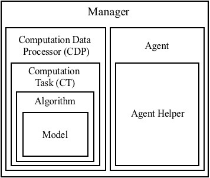
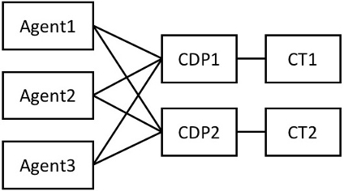

# Modules in FLARE

There are seven important modules of FLARE in total. Their structural relationships are illustrated by the figure below.



* [Model](#model)
* [Algorithm](#algorithm)
* [Computation Task](#ct)
* [Computation Data Processor](#cdp)
* [Agent](#agent)
* [Agent Helper](#ah)
* [Manager](#manager)

## Model <a name="model"/>
The `Model` class inherits `torch.nn.Module` and implements the network structure. It defines all the computations that the user wants the network to support. These computation functions will be called by an `Algorithm` object that owns the `Model` object. This class only defines a network but is not responsible for training its parameters.

Sometimes after a `Model` is implemented, it might be reused in different scenarios. For example, we have defined a CNN that accepts an image input and outputs several Q values for action control when playing Atari. This same model class can be used by both SARSA and Q-learning, regardless of the their different training objectives.

#### Customization
To customize a new `Model`, the user needs to inherit the base model defined in `<flare_root>/flare/framework/algorithm.py`. Each model has several specs functions to be defined, and each specs function specifies the formats of input/output data. There are currently four possible specs functions in total:
```python
@abstractmethod
def get_input_specs(self):
    pass

def get_state_specs(self):
    return []

@abstractmethod
def get_action_specs(self):
    pass

def get_reward_specs(self):
    return [("reward", dict(shape=[1]))]
```
where `get_state_specs` and `get_reward_specs` are optional. By default, the model is expected not to use temporal memory (empty state specs) and receives a single scalar reward.

The `(name props)` tuples returned by a specs function serve the purpose of retrieving required data from a collection of inputs. For example, suppose the original input is a dictionary `{a=x, b=y, c=z}` where `a,b,c` are data names and `x,y,z` are data, and the `Model` wants to use data `a` and `b` as its network inputs. Then the user could write
```python
def get_input_specs(self):
    return [('a', dict(shape=[10])), ('b', dict(shape=[5]))]
```
where `a` is declared to be a vector of length 10 and `b` a vector of length 5. This information will eventually be used by the `Algorithm` to retrieve input data and the user can assume that the `Algorithm` contains keywords `a` and `b` in its inputs of `predict()` and `learn()`.

Example:
```python
class SimpleModelDeterministic(Model):
    """
    A naive model that has a deterministic continuous action which is
    computed as a function of the input.
    """
    def __init__(self, dims, perception_net):
        super(SimpleModelDeterministic, self).__init__()
        assert isinstance(dims, list) or isinstance(dims, tuple)
        self.dims = dims
        self.perception_net = perception_net

    def get_input_specs(self):
        return [("sensor", dict(shape=self.dims))]

    def get_action_specs(self):
        return [("continuous_action", dict(shape=self.dims))]

    def policy(self, inputs, states):
        """
        Called by an algorithm that owns this model.
        """
        # we have the "sensor" keyword in self.get_input_specs
        hidden = self.perception_net(inputs["sensor"])
        # we must return the action keyword "continuous_action" since it is defined
        # in self.get_action_specs
        return dict(continuous_action=Deterministic(hidden)), states
```

## Algorithm <a name="algorithm"/>
The `Algorithm` class implements the prediction and training logic based on a `Model`. It decides which functions of the model to call for prediction, and which functions to call for learning the network parameters. Besides the forward and backward logic, sometimes an `Algorithm` could have additional logic of manipulating the model. For example, the `SimpleQ` algorithm periodically copies the training model to a reference model in its `learn()` to stabilize the training.

An `Algorithm` might be reused in different scenarios. For example, given a fixed `SimpleQ` algorithm implementation, we can easily apply it to either an MLP model or a CNN model to account for different observation inputs, without changing the learning objective (both use Q-learning).

#### Customization
To customize a new `Algorithm`, the user needs to inherit the base algorithm defined in `<flare_root>/flare/framework/algorithm.py`. Two functions need to be overridden:
```python
def predict(self, inputs, states):
    """
    Given the inputs and states, this function does forward prediction and updates states.
    Input: inputs(dict), states(dict)
    Output: actions(dict), states(dict)

    Optional: an algorithm might not implement predict()
    """
    pass

def learn(self, inputs, next_inputs, states, next_states, next_alive,
          actions, next_actions, rewards):
    """
    This function computes a learning cost to be optimized.
    The return should be the cost and updated states.
    Output: cost(dict), states(dict)

    Optional: an algorithm might not implement learn()
    """
    pass
```
The `predict()` function decides which functions of the model to be called to generate actions. This typically only involves the forward process of the network. The `learn()` function decides which functions of the model to be called to learn network parameters. This typically involves both the forward and backward processes.

For the meanings of the arguments of `predict()` and `learn()`, please see the next section [Computation Task](#ct).

Example:
```python
class TestAlgorithm(Algorithm):
    def __init__(self, model):
        super(TestAlgorithm, self).__init__(model, gpu_id=-1)

    def predict(self, inputs, states):
        # call the model's policy() to get the action distributions and updated states
        distributions, stats = self.model.policy(inputs, states)
        actions = {}
        for key, dist in distributions.iteritems():
            assert isinstance(dist, Deterministic)
            actions[key] = dist.sample()
        return actions, states

    def learn(self, inputs, next_inputs, states, next_states, next_alive,
              actions, next_actions, rewards):
        # for this simple learn() example, we require the continuous action to regress to
        # the input
        cost = (inputs.values()[0] - actions.values()[0]) ** 2
        avg_cost = cost.view(-1).mean()
        avg_cost.backward()
        return dict(cost=avg_cost), states, next_states
```

## Computation Task <a name="ct"/>
`ComputationTask` (CT) is designed to be a relatively independent task an agent performs. A CT will contain an `Algorithm` object which in turn contains a `Model` object. A CT has the following steps in its `predict()` or `learn()`:

1. Convert input Numpy arrays into PyTorch tensors. During conversion, it obtains input/output specs information from the model of the algorithm;
2. Call the algorithm's `predict()` or `learn()`;
3. Detach and convert the PyTorch tensors output by the algorithm back to Numpy arrays.

The agent might have multiple CTs at the same time. It is assumed that there is no gradient flowing between two different CTs. However, different CTs may share common model parameters if their algorithms contain a (partially) common `Model`. It should be noted that each CT has its own training data buffer and/or data sampling schedule. For example, one CT might be a standard RL task that maximizes the episodic reward, while a second CT might be an auxiliary task that tries to predict immediate rewards only when the reward is non-trivial (i.e., balanced data for supervised learning). Another scenario that needs multiple CTs is hierarchical RL where a CT outputs a goal at a higher level and another CT generates actions given the goal for a certain number of time steps.

If there are multiple CTs, the agent is responsible for implementing the calling order of them in its function `_cts_predict()`. The agent is also responsible for implementing when and what to store for each CT in `_cts_store_data`. See more details in the section [Agent](#agent).

Usually a single CT is enough in most scenarios. If there are several costs for your model and they can be optimized together with the same data collection schedule, then it is suggested to define only one CT and put all the costs in its algorithm's `learn()`.

#### Learning and prediction arguments
The function signatures of CT's `predict()` and `learn()` are
```python
def predict(self, inputs, states=None):
    ...
    return pred_actions, pred_states

def learn(self,
          inputs,
          next_inputs,
          next_alive,
          rewards,
          actions,
          next_actions=None,
          states=None,
          next_states=None):
    ...
    return costs
```
At this moment, these two signatures are fixed: the user has no official way to change them. The reason is simple: we believe that these input/output designs are general enough for the possible scenarios we can think of.

Each argument showing above is a dictionary, meaning that it can be a collection of different quantities. The dictionary keys will match the keys of the specs defined by the `Model`. For example, if the model defines
```python
def get_input_specs(self):
    return [("sensor", dict(shape=self.dims))]
```
Then in both `predict()` and `learn()`, the user can expect to get the corresponding inputs by `inputs["sensor"]`.

For now, let's skip the explanations for `states`, `pred_states` and `next_states`. They are only needed if the agent has short-term temporal memory. In that case, we refer the reader to [Short-term Temporal Memory](memory.md) for details. The rest of the arguments are explained below:

Predict:
* `inputs`: the observation inputs at the current time step
* `pred_actions`: the predicted actions given `inputs`

Learn:
* `inputs`: the observation inputs at the current time step
* `actions`: the actions the agent took given `inputs`
* `rewards`: the rewards the agent received by taking `actions`
* `next_inputs`: the observation inputs at the next time step after taking `actions`
* `next_alive`: whether the agent is alive at the next time step
* `next_actions`: the actions the agent took given `next_inputs`

#### No PyTorch code outside CT
For an agent, each CT is a neural blackbox. A CT receives numpy arrays and outputs numpy arrays. Thus the agent does not have to be aware of the existence of PyTorch. In this sense, the implementation of CT potentially can be replaced by other deep learning frameworks such as TensorFlow. Going beyond CT, all the other code is pure Python.

## Computation Data Processor <a name="cdp"/>
`ComputationDataProcessor` (CDP) is a data feeder class designed for `ComputationTask`. Every CT is associated with its own CDP. In the case where we want to use multiple identical agents to speed up the data collection for a CT, the associated CDP is responsible for packing and unpacking multi-agent data. Its job is to record which experiences are from which agents in a learning/prediction batch, in order to return the results to the correct agents after the computations of the CT. A CDP directly communicates with multiple agents, and maintains two loops: `_prediction_loop()` and `_training_loop()` until program termination.



## Agent <a name="agent"/>

## Agent Helper <a name="ah"/>

## Manager <a name="manager"/>
