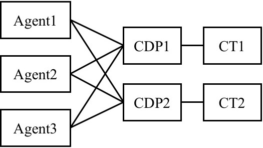

# Modules in FLARE

There are seven important modules of FLARE in total. Their structural relationships are illustrated by the figure below.

<!-- Use html to show images -->
<p></p>

* [Model](#model)
* [Algorithm](#algorithm)
* [Computation Task](#ct)
* [Computation Data Processor](#cdp)
* [Agent](#agent)
* [Agent Helper](#ah)
* [Manager](#manager)

## Model <a name="model"/>
The `Model` class inherits from `torch.nn.Module` and implements the network structure. It defines all the computations that the user wants the network to support. These computation functions will be called by an `Algorithm` object that owns the `Model` object. This class only defines a network but is not responsible for training its parameters.

Sometimes after a `Model` is implemented, it might be reused in different scenarios. For example, we have defined a CNN that accepts an image input and outputs several Q values for action control when playing Atari. This same model class can be used by both SARSA and Q-learning, regardless of the their different training objectives.

#### Customization
To customize a new `Model`, the user needs to derive from the base model defined in `<flare_root>/flare/framework/algorithm.py`. Each model has several specs functions to be defined, and each specs function specifies the formats of input/output data. There are currently four possible specs functions in total:
```python
@abstractmethod
def get_input_specs(self):
    pass

def get_state_specs(self):
    return []

@abstractmethod
def get_action_specs(self):
    pass

def get_reward_specs(self):
    return [("reward", dict(shape=[1]))]
```
where `get_state_specs` and `get_reward_specs` are optional. By default, the model is expected not to use short-term memory (empty state specs) and receives a single scalar reward.

The `(name props)` tuples returned by a specs function serve the purpose of retrieving required data from a collection of inputs. For example, suppose the original input is a dictionary `{a=x, b=y, c=z}` where `a,b,c` are data names and `x,y,z` are data, and the `Model` wants to use data `a` and `b` as its network inputs. Then the user could write
```python
def get_input_specs(self):
    return [('a', dict(shape=[10])), ('b', dict(shape=[5]))]
```
where `a` is declared to be a vector of length 10 and `b` a vector of length 5. This information will eventually be used by the `Algorithm` to retrieve input data and the user can assume that the `Algorithm` contains keywords `a` and `b` in its inputs of `predict()` and `learn()`.

Example:
```python
class SimpleModelDeterministic(Model):
    """
    A naive model that has a deterministic continuous action which is
    computed as a function of the input.
    """
    def __init__(self, dims, perception_net):
        super(SimpleModelDeterministic, self).__init__()
        assert isinstance(dims, list) or isinstance(dims, tuple)
        self.dims = dims
        self.perception_net = perception_net

    def get_input_specs(self):
        return [("sensor", dict(shape=self.dims))]

    def get_action_specs(self):
        return [("action", dict(shape=self.dims))]

    def policy(self, inputs, states):
        """
        Called by an algorithm that owns this model.
        """
        # we have the "sensor" keyword in self.get_input_specs
        hidden = self.perception_net(inputs["sensor"])
        # we must return the action keyword "action" since it is defined
        # in self.get_action_specs
        return dict(action=Deterministic(hidden)), states
```

## Algorithm <a name="algorithm"/>
The `Algorithm` class implements the prediction and training logic based on a `Model`. It decides which functions of the model to call for prediction, and which functions to call for learning the network parameters. Besides the forward and backward logic, sometimes an `Algorithm` could have additional logic of manipulating the model. For example, the `SimpleQ` algorithm periodically copies the training model to a reference model in its `learn()` to stabilize the training.

An `Algorithm` might be reused in different scenarios. For example, given a fixed `SimpleQ` algorithm implementation, we can easily apply it to either an MLP model or a CNN model to account for different observation inputs, without changing the learning objective (both use Q-learning).

#### Customization
To customize a new `Algorithm`, the user needs to derive from the base algorithm defined in `<flare_root>/flare/framework/algorithm.py`. Two functions need to be overridden:
```python
def predict(self, inputs, states):
    """
    Given the inputs and states, this function does forward prediction and updates states.
    Input: inputs(dict), states(dict)
    Output: actions(dict), updated_states(dict)

    Optional: an algorithm might not implement predict()
    """
    pass

def learn(self, inputs, next_inputs, states, next_states, next_alive,
          actions, next_actions, rewards):
    """
    This function computes learning costs to be optimized.
    The return should be the costs
    Output: cost(dict)

    Optional: an algorithm might not implement learn()
    """
    pass
```
The `predict()` function decides which functions of the model to be called to generate actions. This typically only involves the forward process of the network. The `learn()` function decides which functions of the model to be called to learn network parameters. This typically involves both the forward and backward processes. It could also manipulate the gradients (e.g., clipping) before performing update steps of the optimizer.

For the meanings of the arguments of `predict()` and `learn()`, please see the next section [Computation Task](#ct).

Example:
```python
class TestAlgorithm(Algorithm):
    def __init__(self, model):
        super(TestAlgorithm, self).__init__(model, gpu_id=-1)

    def predict(self, inputs, states):
        # call the model's policy() to get the action distributions and updated states
        distributions, stats = self.model.policy(inputs, states)
        actions = {}
        for key, dist in distributions.iteritems():
            assert isinstance(dist, Deterministic)
            actions[key] = dist.sample()
        return actions, states

    def learn(self, inputs, next_inputs, states, next_states, next_alive,
              actions, next_actions, rewards):
        # for this simple learn() example, we require the continuous action to regress to
        # the input
        cost = (inputs.values()[0] - actions.values()[0]) ** 2
        avg_cost = cost.view(-1).mean()
        avg_cost.backward()
        return dict(cost=avg_cost)
```

## Computation Task <a name="ct"/>
`ComputationTask` (CT) is designed to be a relatively independent task an agent performs. A CT will contain an `Algorithm` object which in turn contains a `Model` object. A CT has the following steps in its `predict()` or `learn()`:

1. Convert input Numpy arrays into PyTorch tensors. During conversion, it obtains input/output specs information from the model of the algorithm;
2. Call the algorithm's `predict()` or `learn()`;
3. Detach and convert the PyTorch tensors output by the algorithm back to Numpy arrays.

The agent might have multiple CTs at the same time. It is assumed that there is no gradient flowing between two different CTs. However, different CTs may share common model parameters if their algorithms contain a (partially) common `Model`. It should be noted that each CT has its own training data buffer and/or data sampling schedule. For example, one CT might be a standard RL task that maximizes the episodic reward, while a second CT might be an auxiliary task that tries to predict immediate rewards only when the reward is non-trivial (i.e., balanced data for supervised learning). Another scenario that needs multiple CTs is hierarchical RL where a CT outputs a goal at a higher level and another CT generates actions given the goal for a certain number of time steps.

If there are multiple CTs, the agent is responsible for implementing the calling order of them in its function `_cts_predict()`. The agent is also responsible for implementing when and what to store for each CT in `_cts_store_data`. See more details in the section [Agent](#agent).

Usually a single CT is enough in most scenarios. If there are several costs for your model and they can be optimized together with the same data collection schedule, then it is suggested to define only one CT and put all the costs in its algorithm's `learn()`.

#### Learning and prediction arguments
The function signatures of CT's `predict()` and `learn()` are
```python
def predict(self, inputs, states=None):
    ...
    return pred_actions, next_states

def learn(self,
          inputs,
          next_inputs,
          next_alive,
          rewards,
          actions,
          next_actions=None,
          states=None,
          next_states=None):
    ...
    return costs
```
At this moment, these two signatures are fixed: the user has no official way to change them. The reason is simple: we believe that these input/output designs are general enough for the possible scenarios we can think of.

Each argument showing above is a dictionary, meaning that it can be a collection of different quantities. The dictionary keys will match the keys of the specs defined by the `Model`. For example, if the model defines
```python
def get_input_specs(self):
    return [("sensor", dict(shape=self.dims))]
```
Then in both `predict()` and `learn()`, the user can expect to get the corresponding inputs by `inputs["sensor"]`.

For now, let's skip the explanations for `states` and `next_states`. They are only needed if the agent has short-term memory. In that case, we refer the reader to [Short-term Memory](memory.md) for details. The rest of the arguments are explained below:

Predict:
* `inputs`: the observation inputs at the current time step
* `pred_actions`: the predicted actions given `inputs`

Learn:
* `inputs`: the observation inputs at the current time step
* `actions`: the actions the agent took given `inputs`
* `rewards`: the rewards the agent received by taking `actions`
* `next_inputs`: the observation inputs at the next time step after taking `actions`
* `next_alive`: whether the agent is alive at the next time step
* `next_actions`: the actions the agent took given `next_inputs`

#### No PyTorch code outside CT
For an agent, each CT is a neural blackbox. A CT receives numpy arrays and outputs numpy arrays. Thus the agent does not have to be aware of the existence of PyTorch. In this sense, the implementation of CT potentially can be replaced by other deep learning frameworks such as TensorFlow. Going beyond CT, all the other code is pure Python.

## Computation Data Processor <a name="cdp"/>
`ComputationDataProcessor` (CDP) is a data feeder class designed for `ComputationTask`. Every CT is associated with its own CDP. In the case where we want to use multiple identical agents to speed up the data collection for a CT, the associated CDP is responsible for packing and unpacking multi-agent data. Its job is to record which experiences are from which agents in a learning/prediction batch, in order to return the results to the correct agents after the computations of the CT. A CDP directly communicates with multiple agents, and maintains two loops: `_prediction_loop()` and `_training_loop()` until program termination.

<p></p>

## Agent <a name="agent"/>
An `Agent` implements the high-level logic of how to interact with the environment and how to collect experiences for learning. It basically runs for a predefined number of game episodes, and for each episode executes the code in `_run_one_episode()`. Inside this function, it coordinates between CTs to generate response to the environment.

We have already provided an implementation of `_run_one_episode()` in `<flare_root>/flare/framework/agent.py`.
```python
def _run_one_episode(self):
    def __store_data(observations, actions, states, rewards):
        learning_ret = self._cts_store_data(
            observations, actions, states, rewards)  ## written by user
        if learning_ret is not None:
            for k, v in learning_ret.iteritems():
                self.log_entry.add_key(k, v)

    observations = self._reset_env()
    states = self._get_init_states()  ## written by user

    while self.alive and (not self.env.time_out()):
        actions, next_states = self._cts_predict(
            observations, states)  ## written by user
        assert isinstance(actions, dict)
        assert isinstance(next_states, dict)
        next_observations, rewards, next_game_over = self._step_env(
            actions)
        __store_data(observations, actions, states, rewards)

        observations = next_observations
        states = next_states
        ## next_game_over == 1:  success
        ## next_game_over == -1: failure
        self.alive = 1 - abs(next_game_over)

    ## self.alive:  0  -- success/failure
    ##              1  -- normal
    ##             -1  -- timeout
    if self.env.time_out():
        self.alive = -1
    actions, _ = self._cts_predict(observations, states)
    zero_rewards = {k: [0] * len(v) for k, v in rewards.iteritems()}
    __store_data(observations, actions, states, zero_rewards)

    ## Record success. For games that do not have a defintion of
    ## 'success' (e.g., 'breakout' never ends), this quantity will
    ## always be zero
    self.log_entry.add_key("success", next_game_over > 0)
    return self._total_reward()
```

It is most likely that this function does not have to be overriden by the user because that its logic is very general. The logic is also quite critical: we suggest a user to have a deep understanding of the agent-environment interaction process before modifying `_run_one_episode()` for a specific purpose. Otherwise the training data might not be correctly collected (e.g., incorrect episode-end behavior for training).

Within this block of code, the user usually has to implement three functions: `_get_init_states`, `_cts_predict` and `_cts_store_data`. The first function needed by memory-augmented agents is explained in details in [Short-term Memory](memory.md). The second function is called to predict actions given the current environment observations. If there are multiple CTs, the agent is responsible for specifying the calling order of them. The third function is called after the agent gets some feedback from the environment after taking actions (`_step_env`), and this feedback along with the current observations are stored in data buffers. If there are multiple CTs, each CT will have its own data buffer. Thus in `_cts_store_data`, the agent is responsible for implementing what data to store for each CT.

The user can derive from the base `Agent` class to implement these three functions. For example, if there is only CT called 'RL', then a `SimpleRLAgent` can be:
```python
class SimpleRLAgent(Agent):
    """
    This class serves as an example of simple RL algorithms, which has only one
    ComputationTask, "RL", i.e., using and learning an RL policy.

    By using different AgentHelpers, this Agent can be applied to either on-
    policy or off-policy RL algorithms.
    """

    def __init__(self,
                 num_games,
                 actrep=1,
                 learning=True,
                 reward_shaping_f=lambda x: x):
        super(SimpleRLAgent, self).__init__(num_games, actrep, learning)
        self.reward_shaping_f = reward_shaping_f

    def _cts_store_data(self, observations, actions, states, rewards):
        ## before storing rewards for training, we reshape them
        for k in rewards.keys():
            ## each r is a reward vector
            rewards[k] = [self.reward_shaping_f(r) for r in rewards[k]]
        ## store everything in the buffer
        data = {}
        data.update(observations)
        data.update(actions)
        data.update(states)
        data.update(rewards)
        ret = self._store_data('RL', data)
        if ret is not None:
            ## If not None, _store_data calls learn() in this iteration
            ## We return the cost for logging
            cost, learn_info = ret
            return {k: comf.sum_cost_array(v)[0] for k, v in cost.iteritems()}

    def _cts_predict(self, observations, states):
        return self.predict('RL', observations, states)
```

The agent predicts and stores data at the current time step. Whenever the agent calls `self._store_data` or `self.predict`, it does not actually perform the computation but only puts data in the queues of CDPs. These queues can also be shared by another agent. The CDPs have their own prediction and training loops that will take out the data from the queues, perform the computations, and return the results to agents.

## Agent Helper <a name="ah"/>
Each `Agent` has a set of `AgentHelper`s. The number of the helpers is equal to the number of CTs (CDPs), with each helper corresponding to a CT. When the agent calls `self._store_data` or `self.predict`, it has to provide the name of the CT and then the corresponding helper actually calls its own `predict` and `_store_data`:
```python
def predict(self, alg_name, inputs, states=dict()):
    ## Convert single instances to batches of size 1
    ## The reason for this conversion is that we want to reuse the
    ## _pack_data() and _unpack_data() of the CDP for handling both training
    ## and prediction data. These two functions assume that data are stored
    ## as mini batches instead of single instances in a buffer.
    inputs_ = {k : [v] for k, v in inputs.iteritems()}
    states_ = {k : [v] for k, v in states.iteritems()}
    prediction, next_states = self.helpers[alg_name].predict(inputs_, states_)
    ## convert back to single instances
    prediction = {k : v[0] for k, v in prediction.iteritems()}
    next_states = {k : v[0] for k, v in next_states.iteritems()}
    return prediction, next_states

def _store_data(self, alg_name, data):
    if self.learning: ## only store when the agent is learning
        self.helpers[alg_name]._store_data(self.alive, data)
```
A helper's responsibility is to manage data collection for its associated CT. As mentioned in [Computation Task](#ct), a CT might have its own data buffer and sampling schedule. Currently we support two kinds of `AgentHelper`:
* `OnlineHelper`: This helper stores a small number of the most recent experiences. When sampling, it takes out all the experiences in the buffer for training. This helper is usually used by on-policy algorithms such as Actor-Critic and SARSA. Some off-policy algorithms such as [PPO2](https://blog.openai.com/openai-baselines-ppo/) also uses it.
* `ExpReplayhelper`: This helper stores a huge number of experiences in a replay buffer. When sampling, it takes a small portion of the entire buffer for training. The sampling strategy could be uniform or [prioritized](https://arxiv.org/abs/1511.05952). Because the buffer is huge, almost all experiences were generated by outdated policies. Thus this helper can only be used by off-policy algorithms such as Q-learning and Off-policy AC.

Essentially we will have an `AgentHelper` matrix for a training setup. An example of 3 agents and 2 CTs is illustrated below:

<p></p>

## Manager <a name="manager"/>
`Manager` is the highest-level concept in FLARE. It creates CTs/CDPs and agents based on the options the user passes in. Once its `start()` is called in the main function, the manager will run CDPs and agents until the termination criterion is met. Currently the manager also maintains a `GameLogger` which is responsible for logging the training and game playing.
```python
def start(self):
    signal.signal(signal.SIGINT, self.__signal_handler)
    self.logger.start()
    for cdp in self.CDPs.values():
        cdp.run()
    for agent in self.agents:
        agent.start()

    while self.agents:
        self.agents[-1].join()
        self.agents.pop()
    for cdp in self.CDPs.values():
        cdp.stop()
    self.logger.running.value = False
    self.logger.join()
```

For an example of how to pass in options to create a `Manager` object, we refer the reader to `<flare_root>/flare/examples/img_ac_example.py`.
