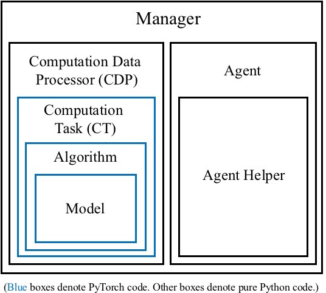

# Modules in FLARE

There are seven important modules of FLARE in total. Their structural relationships are illustrated by the figure below.



* [Model](#model)
* [Algorithm](#algorithm)
* [Computation Task](#ct)
* [Computation Data Processor](#cdp)
* [Agent](#agent)
* [Agent Helper](#ah)
* [Manager](#manager)

## Model <a name="model"/>
The `Model` class inherits `torch.nn.Module` and implements the network structure. It defines all the computations that the user wants the network to support. These computation functions will be called by an `Algorithm` object that owns the `Model` object. This class only defines a network but is not responsible for training its parameters.

Sometimes after a `Model` is implemented, it might be reused in different scenarios. For example, we have defined a CNN that accepts an image input and outputs several Q values for action control when playing Atari. This same model class can be used by both SARSA and Q-learning, regardless of the their different training objectives.

#### Customization
To customize a new `Model`, the user needs to inherit the base model defined in `<flare_root>/flare/framework/algorithm.py`. Each model has several specs functions to be defined, and each specs function specifies the formats of input/output data. There are currently four possible specs functions in total:
```python
@abstractmethod
def get_input_specs(self):
    pass

def get_state_specs(self):
    return []

@abstractmethod
def get_action_specs(self):
    pass

def get_reward_specs(self):
    return [("reward", dict(shape=[1]))]
```
where `get_state_specs` and `get_reward_specs` are optional. By default, the model is expected not to use temporal memory (empty state specs) and receives a single scalar reward.

The `(name props)` tuples returned by a specs function serve the purpose of retrieving required data from a collection of inputs. For example, suppose the original input is a dictionary `{a=x, b=y, c=z}` where `a,b,c` are data names and `x,y,z` are data, and the `Model` wants to use data `a` and `b` as its network inputs. Then the user could write
```python
def get_input_specs(self):
    return [('a', dict(shape=[10])), ('b', dict(shape=[5]))]
```
where `a` is declared to be a vector of length 10 and `b` a vector of length 5. This information will eventually be used by the `Algorithm` to retrieve input data and the user can assume that the `Algorithm` contains keywords `a` and `b` in its inputs of `predict()` and `learn()`.

Example:
```python
class SimpleModelDeterministic(Model):
    """
    A naive model that has a deterministic continuous action which is
    computed as a function of the input.
    """
    def __init__(self, dims, perception_net):
        super(SimpleModelDeterministic, self).__init__()
        assert isinstance(dims, list) or isinstance(dims, tuple)
        self.dims = dims
        self.perception_net = perception_net

    def get_input_specs(self):
        return [("sensor", dict(shape=self.dims))]

    def get_action_specs(self):
        return [("continuous_action", dict(shape=self.dims))]

    def policy(self, inputs, states):
        """
        Called by an algorithm that owns this model.
        """
        # we have the "sensor" keyword in self.get_input_specs
        hidden = self.perception_net(inputs["sensor"])
        # we must return the action keyword "continuous_action" since it is defined
        # in self.get_action_specs
        return dict(continuous_action=Deterministic(hidden)), states
```

## Algorithm <a name="algorithm"/>
The `Algorithm` class implements the prediction and training logic based on a `Model`. It decides which functions of the model to call for prediction, and which functions to call for learning the network parameters. Besides the forward and backward logic, sometimes an `Algorithm` has additional logic of manipulating the model. For example, the `SimpleQ` algorithm periodically copies the training model to a reference model in its `learn()` to stabilize the training.

An `Algorithm` might be reused in different scenarios. For example, given a fixed `SimpleQ` algorithm implementation, we can easily apply it to either an MLP model or a CNN model to account for different observation inputs, without changing the learning objective (both use Q-learning).

#### Customization
To customize a new `Algorithm`, the user needs to inherit the base algorithm defined in `<flare_root>/flare/framework/algorithm.py`. Two functions need to be overridden:
```python
def predict(self, inputs, states):
    """
    Given the inputs and states, this function does forward prediction and updates states.
    Input: inputs(dict), states(dict)
    Output: actions(dict), states(dict)

    Optional: an algorithm might not implement predict()
    """
    pass

def learn(self, inputs, next_inputs, states, next_states, next_alive,
          actions, next_actions, rewards):
    """
    This function computes a learning cost to be optimized.
    The return should be the cost and updated states.
    Output: cost(dict), states(dict)

    Optional: an algorithm might not implement learn()
    """
    pass
```
The `predict()` function decides which functions of the model to be called to generate actions. This typically only involves the forward process of the network. The `learn()` function decides which functions of the model to be called to learn network parameters. This typically involves both the forward and backward processes.

For the meanings of the arguments of `predict()` and `learn()`, please see the next section [Computation Task](#ct).

Example:
```python
class TestAlgorithm(Algorithm):
    def __init__(self, model):
        super(TestAlgorithm, self).__init__(model, gpu_id=-1)

    def predict(self, inputs, states):
        # call the model's policy() to get the action distributions and updated states
        distributions, stats = self.model.policy(inputs, states)
        actions = {}
        for key, dist in distributions.iteritems():
            assert isinstance(dist, Deterministic)
            actions[key] = dist.sample()
        return actions, states

    def learn(self, inputs, next_inputs, states, next_states, next_alive,
              actions, next_actions, rewards):
        # for this simple learn() example, we require the continuous action to regress to
        # the input
        cost = (inputs.values()[0] - actions.values()[0]) ** 2
        avg_cost = cost.view(-1).mean()
        avg_cost.backward()
        return dict(cost=avg_cost), states, next_states
```

## Computation Task <a name="ct"/>

## Computation Data Processor <a name="cdp"/>

## Agent <a name="agent"/>

## Agent Helper <a name="ah"/>

## Manager <a name="manager"/>
